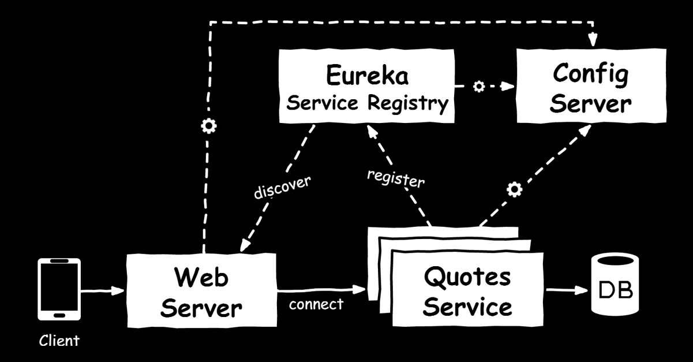

# Popular Quotes App

This is a simple app for showing random quotes. In it implemented using a microservice architecture. 

Different Spring Cloud projects are used in this demonstration app, like [Spring Cloud Config](https://cloud.spring.io/spring-cloud-config/) (server and client) and [Spring Cloud Netflix](https://cloud.spring.io/spring-cloud-netflix/) projects *Eureka* (for Service discovery) and *Hystrix* (as circuit breaker). 

## Building the Project

Prerequesite is to have Java 8 and Maven 3 installed.

To build the project execute:

    mvn clean install

## Configuration Files

Config Server is configured to load configuration files from a GIT repository:
https://git.seavus.com/opensource/spring-cloud-quotes-app-config/tree/master
	
## Running the Application

First you need to start **Config Server**. Open a new console and execute:

    cd spring-cloud-config-server
	mvn spring-boot:run

Now start **Eureka service discovery server**. Open a new console and execute:

    cd spring-cloud-eureka-server
	mvn spring-boot:run	
	
Start a **Web module**. Open a new console and execute:

    cd spring-cloud-wen
	mvn spring-boot:run	
	
Navigate to [http://localhost:8080](http://localhost:8080). Since *quotes-service* is still not started you should see a "fallback" quote shown every time you reload the page.

Start quotes-service module. Open a new console and execute:

    cd spring-cloud-quotes-service
    export JAVA_TOOL_OPTIONS=-Dfile.encoding=UTF-8
    mvn spring-boot:run

*Note: Since your console default character set encoding may not be UTF-8, you have to set proper java file encoding for Maven to use. In other way, some characters from the example quotes will not be shown correctly.
If you are on Windows change "export" to "set" like:
    set JAVA_TOOL_OPTIONS=-Dfile.encoding=UTF-8*
	
Wait some moments and reload [http://localhost:8080](http://localhost:8080). Refresh the page couple of times. You should see some motivational quotes showing on the screen.

### Running Additional quotes-service Module

You can start additional *quotes-service* instances, with different quotes. Open a new console and execute:

    cd spring-cloud-quotes-service
    export JAVA_TOOL_OPTIONS=-Dfile.encoding=UTF-8
    mvn spring-boot:run -Drun.profiles=yoda
	
This should load additional *quotes-service* instsance, serving the quotes from the Star Wars. 
Wait some moments and reload [http://localhost:8080](http://localhost:8080). Refresh the page couple of times. You should see now the motivational quotes but as well quotes from Star Wars.

### Eureka Server Dashboard

Open [http://localhost:8761](http://localhost:8761). It is the Eureka server Dashboard. In the section "Instances currently registered with Eureka", you should be able to see that there are 2 QUOTES-SERVICE instances and 1 WEB-SERVER instance registered at Eureka.